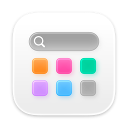

# macOS26启动台｜Launchpad for macOS26

**简体中文** | **[English](./README-en.md)**

<div align="center">
	
	<h2>启动台</h2>
	
  	
  	
</div>

## 目录

- [简介](#简介)
- [主要特性](#主要特性)
- [系统要求](#系统要求)
- [安装](#安装)
- [使用方法](#使用方法)
- [配置说明](#配置说明)
- [开发贡献](#开发贡献)
- [许可证](#许可证)
- [联系我们](#联系我们)

## 简介

macOS 26 启动台是一个专为 macOS 系统设计的应用程序启动器，旨在提供更简洁、高效的应用启动体验。由于 macOS 26 移除了原生的启动台功能，本项目作为其替代品，帮助用户快速访问和管理已安装的应用程序。

本应用采用现代化 SwiftUI 框架开发，具有精美的视觉效果和流畅的用户交互体验。

## 主要特性

### 🚀 **快速启动**
- 一键启动任何已安装的应用程序
- 支持键盘快捷键操作
- 启动后自动退出，保持系统简洁

### 🔍 **智能搜索**
- 实时搜索应用，快速定位
- 支持模糊匹配，提高查找效率
- 简洁的搜索界面，不干扰视线

### 🎨 **精美界面**
- 现代化的毛玻璃视觉效果
- 自适应布局，支持不同屏幕尺寸
- 应用图标清晰展示，视觉舒适

### ⚙️ **灵活配置**
- 自定义隐藏应用列表
- 支持批量添加和移除隐藏应用

### 🛡️ **隐私保护**
- 所有配置数据本地存储
- 无需网络权限，完全离线运行
- 不收集任何用户数据

## 系统要求

- **操作系统**：macOS 26 Beta 或更高版本
- **设备**：Mac 电脑（支持 Apple Silicon 和 Intel 芯片）
- **内存**：建议 8GB 或以上
- **存储空间**：50MB 可用空间
- **开发环境**：Xcode 15.0+, Swift 5.9+

## 安装

### 方法一：源码编译（推荐开发者）

1. **克隆项目到本地**：
```bash
git clone https://github.com/ray1084784475/macOS26-Launchpad.git
cd macOS26-Launchpad
```

2. **打开项目**：
```bash
open 启动台.xcodeproj
```

3. **编译运行**：
   - 选择目标设备（您的 Mac）
   - 按下 `⌘ + R` 编译并运行

### 方法二：直接下载安装包

1. 前往 [Releases 页面](https://github.com/ray1084784475/macOS26-Launchpad/releases)
2. 下载最新版本的 `.dmg` 文件（或 `.app` 文件，直接双击启动或复制到「应用程序」文件夹）
3. 双击打开磁盘映像
4. 将应用拖拽到「应用程序」文件夹
5. 在「应用程序」中启动本应用（或添加到程序坞，快捷启动）


## 使用方法

### 基础操作

1. **启动应用**：
   - 双击应用图标启动启动台或单击程序坞中的图标
   - 应用会自动全屏显示
 


2. **搜索应用**：
   - 在顶部搜索框中输入应用名称
   - 系统会实时显示匹配结果

3. **启动应用**：
   - 点击应用图标启动对应应用
   - 启动后，启动台会自动退出
 
 

4. **退出启动台**：
   - 点击**顶部**（搜索框附近空白区域）
   - 或使用快捷键 `⌘ + Q`

### 快捷键

| 快捷键 | 功能说明 |
|--------|----------|
| `⌘ + ,` | 打开设置窗口 |
| `⌘ + I` | 打开关于窗口 |
| `⌘ + Q` | 退出应用 |

### 隐藏应用管理

1. **打开设置**：
   - 使用快捷键 `⌘ + ,`
   - 或在应用菜单中选择「设置」

2. **添加隐藏应用**：
   - 点击「添加应用」按钮
   - 选择应用文件（.app 格式）
   - 或直接输入应用路径

3. **移除隐藏应用**：
   - 在隐藏应用列表中
   - 点击应用旁边的垃圾桶图标

4. **应用更改**：
   - 点击「完成」保存设置
   - 重启应用使更改生效


## 开发贡献

我们欢迎并感谢所有开发者为本项目做出的贡献！

开发者可以通过邮件`ray_eay@foxmail.com`或`1084784475@qq.com`联系。


## 许可证

本项目采用 MIT 许可证 - 查看 [LICENSE](./LICENSE) 文件了解详情。


## 联系我们

如果您在使用过程中遇到任何问题或有改进建议，欢迎通过以下方式联系我们：

### 反馈渠道

1. **GitHub Issues**：
   - 前往 [Issues 页面](https://github.com/ray1084784475/macOS26-Launchpad/issues)
   - 查看现有问题或创建新 Issue
   - 详细描述问题现象和复现步骤

2. **功能建议**：
   - 描述您的使用场景和期望功能
   - 提供相关参考或示例

3.  **其它方式**：
      - 通过邮件`ray_eay@foxmail.com`或`1084784475@qq.com`联系。

### 问题报告模板

为了更好地理解和解决问题，请按照以下模板提交问题：

```
## 问题描述
[清晰描述遇到的问题]

## 复现步骤
1. [第一步]
2. [第二步]
3. [出现的问题]

## 预期行为
[期望的正确行为]

## 实际行为
[实际发生的错误行为]

## 环境信息
- 设备型号: [例如 MacBook Pro 2024(型号标识符Mac16,8)]
- 芯片类型: [例如 Apple M4 Pro]
- 应用版本: [例如 1.0(1)]

## 截图或日志
[如有，请提供相关截图或错误日志]
```

---

<div align="center">

<h2>让应用启动变得更简单、更高效</h2>

<b>如果这个项目对您有帮助，请给它一个 ⭐️ 支持<b>


</div>
